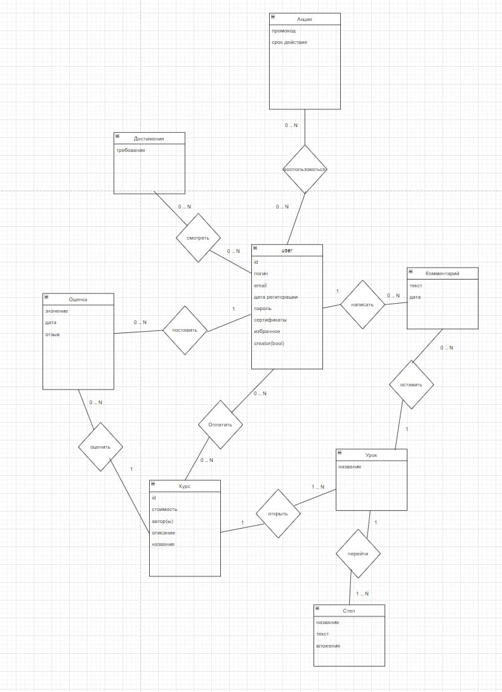
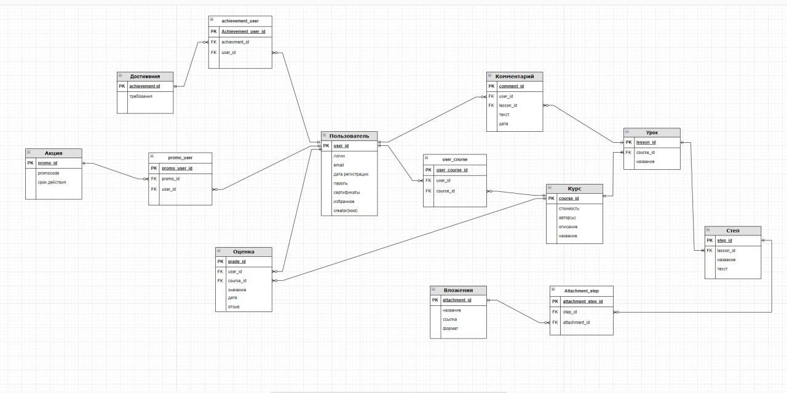
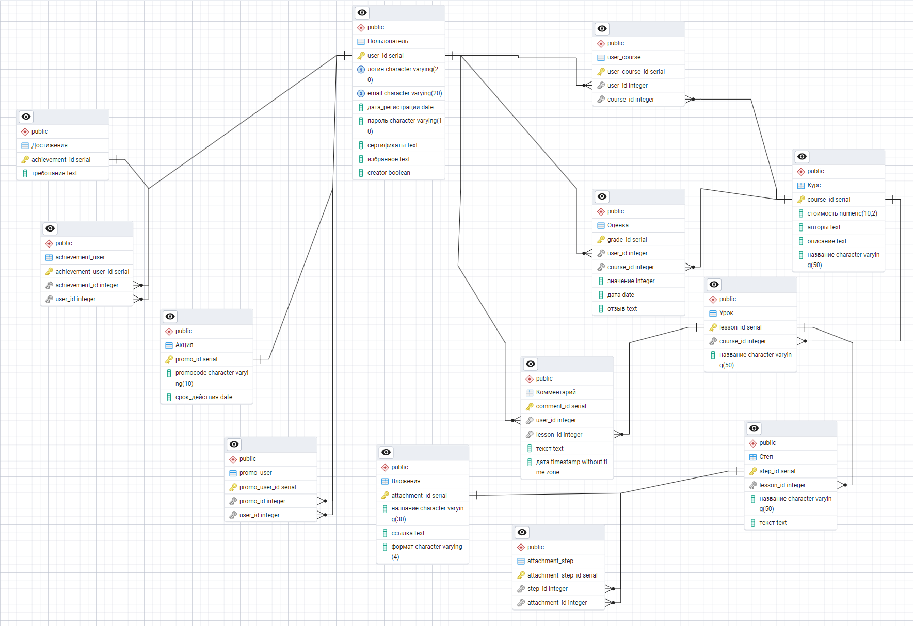

МИНИСТЕРСТВО НАУКИ И ВЫСШЕГО ОБРАЗОВАНИЯ РОССИЙСКОЙ ФЕДЕРАЦИИ ФЕДЕРАЛЬНОЕ ГОСУДАРСТВЕННОЕ АВТОНОМНОЕ ОБРАЗОВАТЕЛЬНОЕ УЧРЕЖДЕНИЕ ВЫСШЕГО ОБРАЗОВАНИЯ

# Национальный исследовательский ядерный университет «МИФИ»

# Институт интеллектуальных кибернетических систем

**Кафедра кибернетики (№ 22)**

**Отчёт о работе по курсу**

**«Базы данных (теоретические основы баз данных)»**

Вариант «Stepik»

|     |     |
| --- | --- |
| Выполнил | Ковальский И.В. |
| Группа | Б22-514 |
| Вариант | Stepik |
| Преподаватель | Петровская А.В. |
| Проверяющий | Панин И.С. |
| Оценка | 85(C) |

**Москва 2024**

**Содержание**

1.  [Формулировка задания 3](#_TOC_250012)
2.  [Концептуальная модель базы данных 3](#_TOC_250011)
    1.  [Конкретизация предметной области 4](#_TOC_250010) 
    2.  [Описание предметной области 4](#_TOC_250009) 
    3.  [Описание атрибутов 4](#_TOC_250008) 
3.  [Логическое проектирование 6](#_TOC_250007) 
4.  [Физическое проектирование 7](#_TOC_250006) 
    1.  [Создание таблиц 7](#_TOC_250005) 
    2.  [Заполнение базы данных 11](#_TOC_250004)
        1.  [Подготовка данных 11](#_TOC_250003)
        2.  [Программа заполнения базы данных 12](#_TOC_250002)
        3.  [Результаты заполнения 18](#_TOC_250001)
5.  [Выполнение запросов 23](#_TOC_250000)

# Формулировка задания

Спроектировать базу данных для образовательной онлайн-платформы, предоставляющей доступ к различным учебный курсам. База данных должна содержать информацию об авторах, студентах, курсах, дисциплинах, пройденными ими, заданиях.

# Концептуальная модель базы данных

После проведения анализа предметной области была спроектирована следующая концептуальная модель:

Рисунок 1 – Концептуальная модель базы данных

# Конкретизация предметной области

Необходимо создать систему, хранящую информацию о прохождении, завершении, покупке курсов пользователями. У каждого курса есть уроки, у каждого урока есть степы. Под каждым курсом можно оставлять комментарии. База данных должна отражать полное количество курсов на аккаунте у каждого пользователя, а также его результаты.

# Описание предметной области

Каждому конкретному студенту и автору в его личном кабинете доступна следующая информация: список купленных курсов, достижений, сертификатов, а также результаты успеваемости по каждому из них.

# Описание атрибутов

В процессе анализа были выделены следующие атрибуты, название и описание которых приведены в таблице ниже**:**

|     |     |
| --- | --- |
| **Имя атрибута** | **Расшифровка** |
| id  | Уникальный идентификатор. Есть у каждого объекта. |

|     |     |
| --- | --- |
| логин | Учетные данные пользователя, которые используются для аутентификации. |
| email | Учетные данные пользователя, которые используются для аутентификации. |
| Дата регистрации | Дата регистрации на платформе. |
| Название курса | Название конкретного курса |
| Сертификат | Список сертификатов по успешно завершенным курса у каждого пользователя. |
| Избранное | Список курсов, добавленных пользователем в избранное. |
| Creator | Пометка, является ли пользователь создателем курсов. |
| Стоимость | Стоимость покупки курса. |
| Промокод | Код, для получения скидки при покупке курсов. |
| Срок действия | Срок действия промокода. |

# Логическое проектирование

Следующим шагом на основе КМПО была разработана логическая модель базы данных, представленная ниже:  

Рисунок 2 – Логическая модель базы данных

Все таблицы находятся в 3 нормальной форме(3нф). Для связей “многие ко многим” созданы промежуточные таблицы.

# Физическое проектирование

В качестве СУБД для реализации разработанной базы данных была выбрана PostgreSQL. В связи с проведённым анализом предметной области была проработана следующая физическая схема БД. Она представлена на следующем рисунке:  

Рисунок 3 – Графическое представление базы данных

